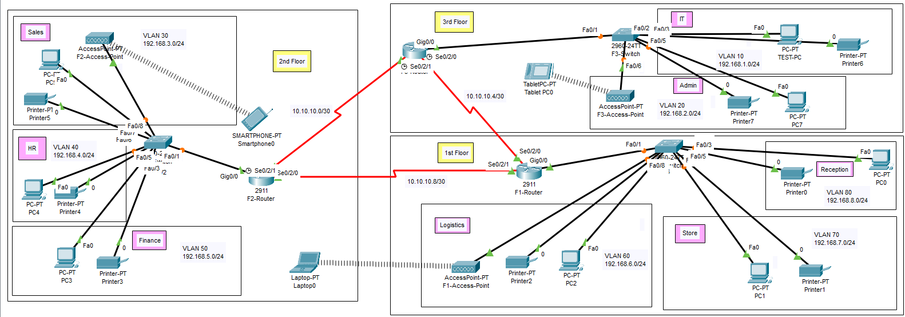

# Hotel Management Networking Project

This project implements a multi-floor network for Vic Modern Hotel, with VLANs, DHCP, OSPF routing, wireless access, and secure remote management.

## Project Overview

This project implements a multi-floor network for Vic Modern Hotel, with VLANs, DHCP, OSPF routing, wireless access, and secure remote management.

## Subnetting Details

* 1st Floor:
  * Reception: VLAN 80, 192.168.8.0/24
  * Store: VLAN 70, 192.168.7.0/24
  * Logistics: VLAN 60, 192.168.6.0/24
* 2nd Floor:
  * Finance: VLAN 50, 192.168.5.0/24
  * HR: VLAN 40, 192.168.4.0/24
  * Sales/Marketing: VLAN 30, 192.168.3.0/24
* 3rd Floor:
  * Admin: VLAN 20, 192.168.2.0/24
  * IT: VLAN 10, 192.168.1.0/24
* Router interconnections: 10.10.10.0/30, 10.10.10.4/30, 10.10.10.8/30

## Devices Used

* 8 PCs
* 3 Routers
* 3 Switches
* 1 Smartphone
* 1 Laptop
* 1 Tablet
* 3 Access Points
* 8 Printers

## Topology Overview

The network is designed across three floors of Vic Modern Hotel:
- **1st Floor:** Reception, Store, Logistics with dedicated VLANs connected to F1-Switch.
- **2nd Floor:** Finance, HR, Sales/Marketing with dedicated VLANs connected to F2-Switch.
- **3rd Floor:** IT and Admin with dedicated VLANs connected to F3-Switch.
- Routers (F1-Router, F2-Router, F3-Router) are interconnected via serial links for routing between floors.
- Wireless devices connect via access points distributed across floors.
- Each router handles DHCP for its floor and OSPF for inter-floor routing.

## How It Works

1. Each department is assigned its own VLAN on the respective floor switch.
2. Trunk links between routers and switches carry multiple VLANs to enable inter-VLAN routing.
3. Routers are configured with sub-interfaces for each VLAN, matching the respective IP subnet.
4. DHCP pools on routers automatically assign IP addresses to devices within each VLAN.
5. Serial connections between routers (10.10.10.x /30 networks) enable routing across floors.
6. OSPF is configured on all routers to advertise networks and allow inter-floor communication.
7. Access points provide wireless connectivity for laptops, smartphones, and tablets.
8. Port security is implemented on IT department switch to restrict access to the test PC.
9. SSH is configured on all routers for secure remote management.
10. **Current Issue:** Inter-VLAN routing seems incomplete, so devices cannot ping hosts on other floors yet; this is open for improvement.

## What I Learned

* How to design and implement a multi-floor VLAN-based network.
* Configuring DHCP pools on routers for dynamic IP assignment.
* Using sub-interfaces on routers for inter-VLAN routing.
* Configuring OSPF across multiple routers for network communication.
* Setting up trunk ports to carry multiple VLANs.
* Implementing SSH for secure router management.
* Applying port security to limit access on switch ports.
* Troubleshooting inter-VLAN routing and OSPF adjacency issues.
