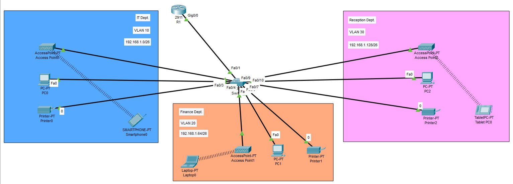

# Small Office Home Office (SOHO) Network Design & Implementation

## Project Overview
This project demonstrates the design and implementation of a **small branch office network** using **Cisco devices** in Packet Tracer.  
The goal was to connect three departments (Admin/IT, Finance/HR, and Customer Service/Reception) in separate VLANs with both wired and wireless connectivity.  
All hosts receive IP addresses dynamically via DHCP, and inter-VLAN communication is enabled through router-on-a-stick configuration.

---

## Subnetting Details
- **Base Network**: `192.168.1.0/24`  
- **No. of required subnets**: 3  
- **Borrowed bits (n)**: 2 → Subnet mask = `255.255.255.192 (/26)`  
- **Block size**: 64  

**Subnets:**
1. **IT Department**  
   - Network ID: `192.168.1.0`  
   - Broadcast: `192.168.1.63`  
   - Host Range: `192.168.1.1 – 192.168.1.62`  

2. **Finance/HR Department**  
   - Network ID: `192.168.1.64`  
   - Broadcast: `192.168.1.127`  
   - Host Range: `192.168.1.65 – 192.168.1.126`  

3. **Reception/Customer Service**  
   - Network ID: `192.168.1.128`  
   - Broadcast: `192.168.1.191`  
   - Host Range: `192.168.1.129 – 192.168.1.190`  

---

## Topology Overview
- **Router (R1)** – Configured with sub-interfaces for inter-VLAN routing and DHCP services.  
- **Switch** – Configured with VLANs (10, 20, 30) and trunk port to the router.  
- **Access Points** – Provide wireless connectivity for laptops, smartphones, and tablets.  
- **Departments**:
  - VLAN 10 → IT/Admin  
  - VLAN 20 → Finance/HR  
  - VLAN 30 → Reception/Customer Service  

---

## Devices Used
- **1 Router (Cisco)**  
- **1 Switch (Cisco)**  
- **3 PCs**  
- **3 Access Points**  
- **1 Smartphone**  
- **1 Laptop**  
- **1 Tablet**

---

## How It Works
1. VLANs are configured on the switch and assigned to the respective department ports.  
2. A trunk link between the router and switch enables inter-VLAN routing.  
3. The router is configured with sub-interfaces (`Gig0/0.10`, `Gig0/0.20`, `Gig0/0.30`) for each VLAN.  
4. DHCP pools provide automatic IP addressing for devices in each VLAN.  
5. Access points extend VLAN-based connectivity to wireless devices.  
6. All departments can communicate while maintaining logical segmentation.  

---

## What I Learned
- VLAN creation and trunk configuration on Cisco switches.  
- Router-on-a-stick setup for inter-VLAN communication.  
- DHCP configuration for multiple VLANs.  
- Subnetting and IP allocation for small networks.  
- Implementing wireless access alongside wired LAN.  

---
