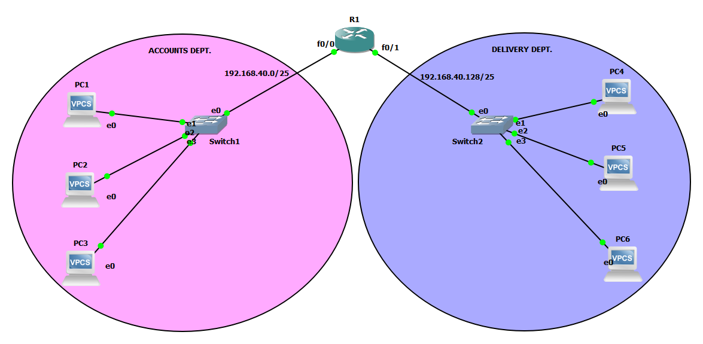

# Simple Network Project with subnetting

This project demonstrates how to divide a single network into two departmental subnets using subnetting.  
The lab is built and tested in **GNS3**.

---

## Subnetting Details

- **Base Network:** `192.168.40.0/24`  
- **Number of Subnets Needed:** 2  
- **Subnet Calculation:**  

2^n = Number of subnets
2^n = 2
n = 1

Where:
n = number of bits borrowed from the host portion to create additional subnets
2^n = the total number of subnets you can create by borrowing n bits.

- **Subnet Mask Calculation:**  
- Binary mask for /25: `11111111.11111111.11111111.10000000`  
- Decimal: `255.255.255.128`  
- **Subnets Created:**
1. **Accounts Department**
   - Network ID: `192.168.40.0/25`
   - Usable Host IPs: `192.168.40.1 – 192.168.40.126`
2. **Delivery Department**
   - Network ID: `192.168.40.128/25`
   - Usable Host IPs: `192.168.40.129 – 192.168.40.254`

---

## Topology Overview

- **Base Network:** `192.168.40.0/24`
- **Subnet Mask:** `255.255.255.128` (`/25`)
- **Subnets Created:**
  - **Accounts Department**
    - Network ID: `192.168.40.0/25`
    - Gateway: `192.168.40.1`
    - PCs: `192.168.40.10 – 192.168.40.12`
  - **Delivery Department**
    - Network ID: `192.168.40.128/25`
    - Gateway: `192.168.40.129`
    - PCs: `192.168.40.130 – 192.168.40.132`

---

## Devices Used

- **1 Router** (to provide gateways and inter-subnet routing)  
- **2 Switches** (one for each department)  
- **6 PCs** (3 in Accounts, 3 in Delivery)

---

## How It Works

- Each department is placed in its own subnet.  
- The router provides gateway IPs for each subnet.  
- PCs within the same subnet can communicate directly.  
- Inter-subnet communication depends on router configuration (can be allowed or restricted).  
